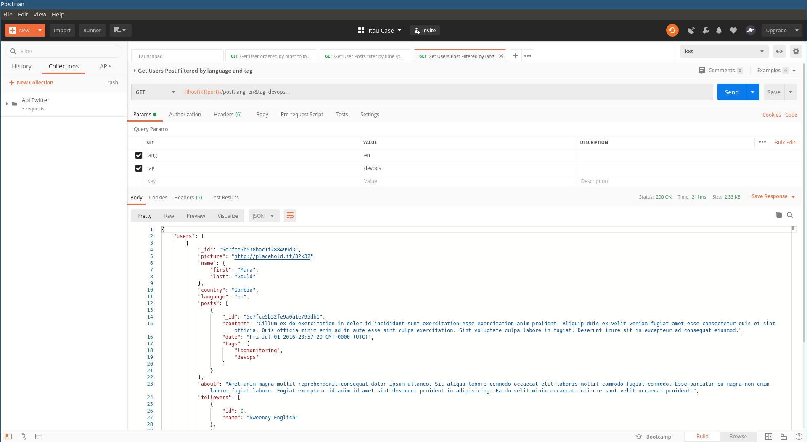

# k8s-provision
Wellcome to K8S provision Repo

## Infrastructure provision and Server Automation
This repo aims to provision Kubernetes infrastructure and server automation for production and development environments.

## Projects repository 
Also contains projects inside /apps 

### Twitter API 
This project expose twitter data:
- users ordered by followers
- user posts in a given hour
- user posts filtered by language and hashtags 

# Requirements
- Unix System
- Terraform > v11
- jq
- python3
- kubectl
- istioctl
- GCP service account key
- An account in Google Cloud with access to this project

## Setting Up GCP Service Account Key
Ask the System Administrator for the service account key and place it at
/scripts/terraform/account.json

## Setting up the environment in two steps

### 1 - Provision Cluster  with terraform

```bash
./run.sh provision --env [prod|dev]
```

You probably will have to run twice, because there is a bug 
with kubernetes CRD status, and probably the gateway CRD will not
be ready when terraform will try to apply the projects manifests.

Terraform will output the cluster information like the folowing:
```
Connect_to_gke_cluster = gcloud container clusters get-credentials developer-provision-terraform-gyxdglx --region us-central1 --project project-name
Endpoint_DNS = api.gyxdglx.my-dns.com.
Ingress_Gateway_IP = xx.xxx.xxx.xx
cluster_name = developer-provision-terraform-gyxdgl
```


### 2 - Restart the pods to have istio sidecar injection
```bash
kubectl delete --all pods --namespace=bookinfo && kubectl delete --all pods --namespace=api
```

## Destroying Environment

```bash
./run.sh destroy --env [prod|dev]
```

## Acessing Dashboards
Istioctl dashboard <dashboard-name>

names:
- grafana
- prometheus
- jaeger


## Logging
You can see the logs in google cloud platform:

Navigate do stackdriver loggin (page)[https://console.cloud.google.com/logs/viewer]

Use the dropdown to select Kubernetes Container > Cluster Name > Namespace > Container Name

Stackdriver automatically  recognized log levels if formated like the examples bellow:

---


## Monitoring
### Service Monitoring
You can access Grafana Dashboard as described above and see, the services
request per seconds, sizes, non 5XX stats and others metrics.

---

---


### Tracing
You can see Tracing between services, by chronological order with Jaeger

---

---

---

---


### Postman
You can import postman collection using the file postman_collection.json



## Known Issues:
### google: could not find default credentials

solution:
```
gcloud auth application-default login
```

